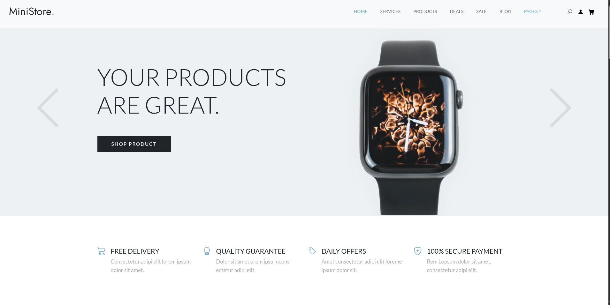
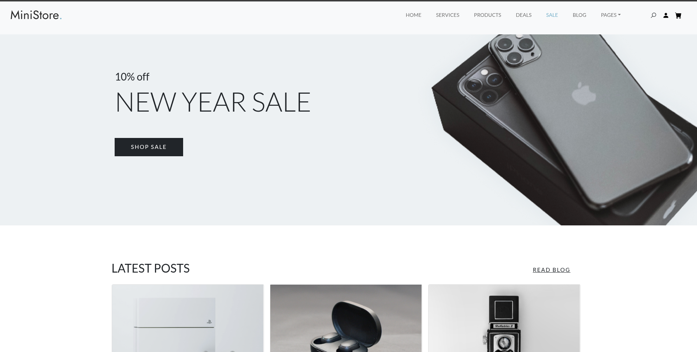
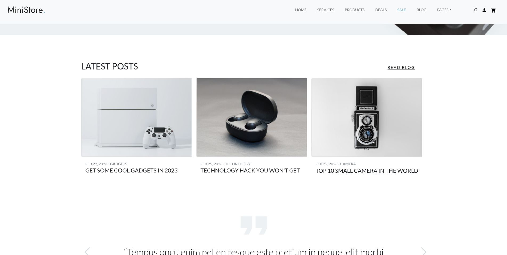

# Ministore UI

`Ministore UI` is a single-page e-commerce landing page design built with HTML, CSS, Bootstrap, and a small amount of JavaScript. The page focuses on storefront presentation rather than backend functionality.

## What this project includes

- Hero slider for featured products
- Service highlights section
- Product showcase grids for mobiles and smart watches
- Promotional sale banner
- Blog preview cards
- Testimonials and newsletter call-to-action
- Instagram strip, social links, and footer

## Tech stack

- HTML5
- CSS3
- Bootstrap
- Swiper.js
- Vanilla JavaScript

## Run locally

This is a static UI project, so you can open `index.html` directly in a browser or serve the folder with a simple local server.

## UI Preview

### Home

### Services and Products

### Sale Banner

### Blog

### Reviews and CTA

### Social and Footer

